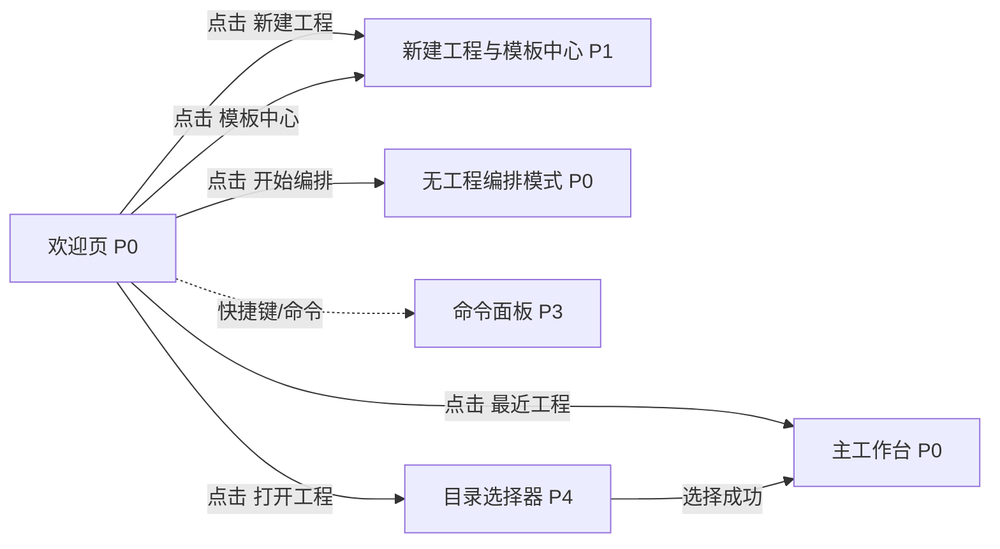

# 欢迎页

## 页面目标
- 在没有活动工程时提供两条并列主路径：`开始编排` 和 `新建工程`，并同时承载最近工程、最近模板与打开已有工程。

## 进入与退出
- 进入条件：应用启动且没有恢复到活动工程，或用户主动关闭当前工程。
- 退出路径：返回来源页、切换活动栏、命令面板或关闭当前对象。

## 首层显示（小白默认）
- 产品名与一句话说明
- 并列主操作：开始编排 / 新建工程 / 打开工程
- 最近工程
- 最近模板
- 模板中心入口

## 深层入口（高手）
- 管理最近工程
- 查看模板详情
- 命令面板

## 布局层级
- 顶部品牌区
- 最近工程区
- 最近模板区
- 主操作区

## 页面低保真示意图
```text
+----------------------------------------------------------------------------------+
| 品牌 / 一句话说明                                              命令面板 / 主题   |
+----------------------------------------------------------------------------------+
| 最近工程                                                                  更多... |
| [工程 A] [继续] [定位] [移除]                                                |
| [工程 B] [继续] [定位] [移除]                                                |
+------------------------------------------+---------------------------------------+
| 最近模板                                  | 主操作区                              |
| [软件工厂] [使用模板]                      | [开始编排]                            |
| [小说创作] [使用模板]                      | [新建工程]                            |
| [旅游攻略] [使用模板]                      | [打开工程]                            |
| [视频脚本] [使用模板]                      | [模板中心]                            |
+------------------------------------------+---------------------------------------+
```

## 本页跳转层级示意


## 本页调用的功能文档
- [F-001 启动后进入欢迎页或恢复工作台](../05-功能具体实现方案/01-平台入口与模板/F-001-启动后进入欢迎页或恢复工作台.md) - M / 已完成
- [F-002 欢迎页最近工程列表](../05-功能具体实现方案/01-平台入口与模板/F-002-欢迎页最近工程列表.md) - M / 已完成
- [F-003 欢迎页最近工程管理](../05-功能具体实现方案/01-平台入口与模板/F-003-欢迎页最近工程管理.md) - A / 已完成
- [F-004 欢迎页最近模板与继续使用](../05-功能具体实现方案/01-平台入口与模板/F-004-欢迎页最近模板与继续使用.md) - A / 部分完成
- [F-005 欢迎页无工程直接进入编排页](../05-功能具体实现方案/01-平台入口与模板/F-005-欢迎页无工程直接进入编排页.md) - S / 未完成
- [F-010 打开已有工程](../05-功能具体实现方案/01-平台入口与模板/F-010-打开已有工程.md) - M / 已完成
- [F-011 模板中心入口与返回路径](../05-功能具体实现方案/01-平台入口与模板/F-011-模板中心入口与返回路径.md) - A / 部分完成
- [F-015 最近工程快速重开](../05-功能具体实现方案/02-工程与文件/F-015-最近工程快速重开.md) - M / 已完成
- [F-060 无工程状态进入编排页](../05-功能具体实现方案/05-编排与流程资产/F-060-无工程状态进入编排页.md) - S / 未完成
- [F-104 全局通知、空状态、错误态与帮助](../05-功能具体实现方案/08-系统安全与观测/F-104-全局通知、空状态、错误态与帮助.md) - B / 部分完成
- [F-108 小白降噪与高手深层入口](../05-功能具体实现方案/08-系统安全与观测/F-108-小白降噪与高手深层入口.md) - S / 未完成
- [F-109 深浅主题与响应式一致性](../05-功能具体实现方案/08-系统安全与观测/F-109-深浅主题与响应式一致性.md) - A / 部分完成

## 交互要求
- 首层只保留当前页面最常用动作，低频动作统一进入更多菜单、右键或命令面板。
- 任何对象级常用动作都应贴近对象本身，而不是放在远处的全局栏位。
- 所有面板、侧栏和抽屉都必须有紧凑宽度策略。
- 欢迎页上的每个一级动作，都必须明确会打开 `P0/P1/P4` 中的哪一种，不允许“像弹层又像新页面”的灰区。
- `开始编排` 和 `新建工程` 必须被设计成同等级主按钮，不允许用视觉弱化其中任意一个。
