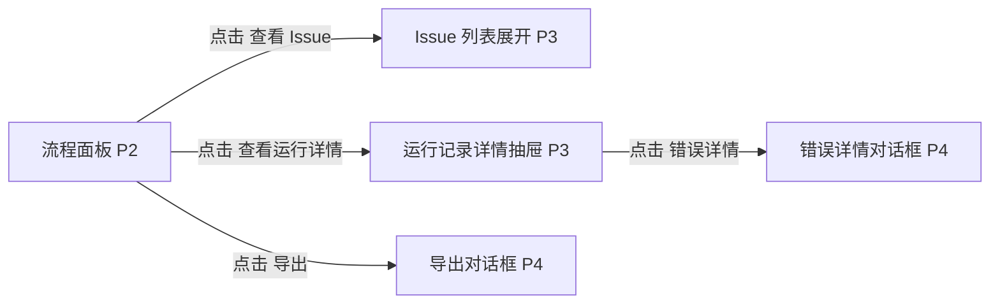

# 流程面板

## 页面目标
- 承载阶段 guard、审查结果、运行记录和阶段确认。

## 进入与退出
- 进入条件：工作台底部面板。
- 退出路径：返回来源页、切换活动栏、命令面板或关闭当前对象。

## 首层显示（小白默认）
- 当前阶段
- guard 检查结果
- 确认/回退
- 运行记录摘要

## 深层入口（高手）
- 展开历史
- 审查 issue 列表
- 失败详情

## 布局层级
- 阶段摘要区
- guard 区
- issue 区
- 运行记录区

## 页面低保真示意图
```text
+----------------------------------------------------------------------------------+
| 当前阶段 / 推荐下一步 / 角色命中模型 / 最近关键运行状态                           |
+--------------------------------+-----------------------------------------------+
| guard 检查                     | 本阶段必需工件完成状态                        |
| - 缺少输入                     | - 原始需求.md  未完成                         |
| - 阻塞 issue                   | - 功能树.md   已完成                          |
+--------------------------------+-----------------------------------------------+
| 审查问题：采纳 / 忽略 / 待处理                                               |
+----------------------------------------------------------------------------------+
| 运行记录摘要 / 错误详情 / 重试 / 确认阶段 / 导出                                 |
+----------------------------------------------------------------------------------+
```

## 本页跳转层级示意


## 本页调用的功能文档
- [F-047 当前阶段显示与下一步建议](../05-功能具体实现方案/04-AI会话与阶段控制/F-047-当前阶段显示与下一步建议.md) - M / 已完成
- [F-048 阶段 guard 检查结果展示](../05-功能具体实现方案/04-AI会话与阶段控制/F-048-阶段guard检查结果展示.md) - S / 部分完成
- [F-049 只有满足 guard 才允许阶段确认](../05-功能具体实现方案/04-AI会话与阶段控制/F-049-只有满足guard才允许阶段确认.md) - S / 未完成
- [F-050 生成阶段草稿并写入工件](../05-功能具体实现方案/04-AI会话与阶段控制/F-050-生成阶段草稿并写入工件.md) - S / 部分完成
- [F-051 AI 内部过程显性化展示](../05-功能具体实现方案/04-AI会话与阶段控制/F-051-AI内部过程显性化展示.md) - S / 部分完成
- [F-052 红蓝裁判审查子流程](../05-功能具体实现方案/04-AI会话与阶段控制/F-052-红蓝裁判审查子流程.md) - S / 部分完成
- [F-053 审查问题采纳/忽略/待处理](../05-功能具体实现方案/04-AI会话与阶段控制/F-053-审查问题采纳-忽略-待处理.md) - A / 部分完成
- [F-054 运行记录、错误与重试](../05-功能具体实现方案/04-AI会话与阶段控制/F-054-运行记录、错误与重试.md) - A / 部分完成
- [F-058 角色实际命中模型可见](../05-功能具体实现方案/04-AI会话与阶段控制/F-058-角色实际命中模型可见.md) - A / 部分完成
- [F-087 模板工件目录查看](../05-功能具体实现方案/06-模板工件与导出/F-087-模板工件目录查看.md) - S / 部分完成
- [F-088 阶段输出契约配置](../05-功能具体实现方案/06-模板工件与导出/F-088-阶段输出契约配置.md) - S / 未完成
- [F-091 运行输出落到工件并显示完成状态](../05-功能具体实现方案/06-模板工件与导出/F-091-运行输出落到工件并显示完成状态.md) - S / 部分完成
- [F-092 导出 md/txt/pdf](../05-功能具体实现方案/06-模板工件与导出/F-092-导出md-txt-pdf.md) - S / 已完成
- [F-093 导出 openspec 文件夹](../05-功能具体实现方案/06-模板工件与导出/F-093-导出openspec文件夹.md) - S / 已完成
- [F-094 软件工厂默认模板闭环](../05-功能具体实现方案/06-模板工件与导出/F-094-软件工厂默认模板闭环.md) - S / 部分完成

## 交互要求
- 首层只保留当前页面最常用动作，低频动作统一进入更多菜单、右键或命令面板。
- 任何对象级常用动作都应贴近对象本身，而不是放在远处的全局栏位。
- 所有面板、侧栏和抽屉都必须有紧凑宽度策略。
- 阶段确认和导出是流程面板中的强控制动作，不能被其他页面的轻按钮替代。
