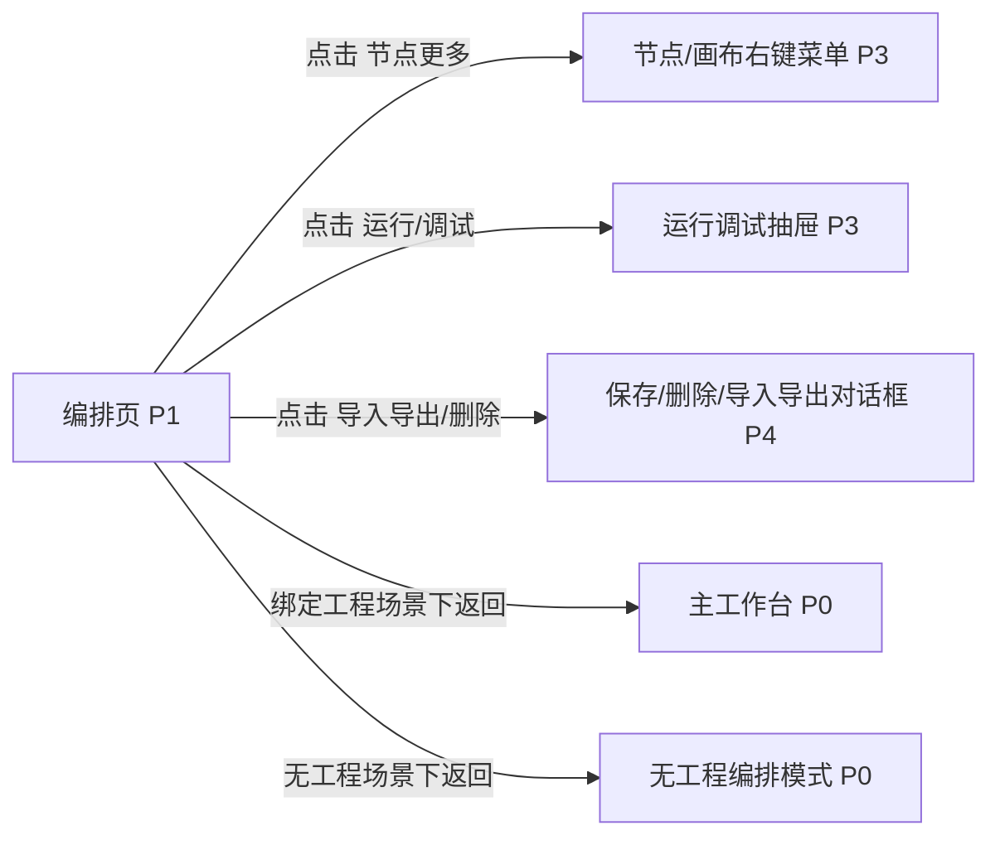

# 编排页

## 页面目标
- 编辑 Flow、Subflow、角色包、工件、连接、工具、输入输出目录和导出契约，是全产品的核心页面。

## 进入与退出
- 进入条件：活动栏点击编排，或欢迎页进入无工程编排模式。
- 退出路径：返回来源页、切换活动栏、命令面板或关闭当前对象。

## 首层显示（小白默认）
- 左侧资产区
- 节点库
- 中间画布
- 右侧 Inspector

## 深层入口（高手）
- 画布右键
- 节点右键
- 调试抽屉
- 历史/恢复

## 布局层级
- 页面头部
- 左侧双层侧栏
- 画布
- 右侧 Inspector
- 底部运行抽屉

## 页面低保真示意图
```text
+----------------------------------------------------------------------------------+
| 返回工作台 / Flow 名称 / 设计态-运行态 / 保存 / 导入导出 / 历史 / 调试           |
+----+-------------------------+--------------------------------+------------------+
|资  | 节点库 / 资产详情       | 画布                           | Inspector         |
|产  | [角色] [工件] [连接]    | [开始] -> [Agent] -> [条件]    | 节点类型           |
|区  | [工具] [Flow] [Subflow] |             \\-> [子流程]      | 输入输出工件       |
|    | 可拖拽小卡片            |                                | 角色包/模型/技能   |
+----+-------------------------+--------------------------------+------------------+
| 底部运行抽屉：节点状态、变量/工件检查、局部重跑、运行日志                          |
+----------------------------------------------------------------------------------+
```

## 本页跳转层级示意


## 本页调用的功能文档
- [F-059 编排页入口](../05-功能具体实现方案/05-编排与流程资产/F-059-编排页入口.md) - S / 已完成
- [F-061 设计态与运行态切换](../05-功能具体实现方案/05-编排与流程资产/F-061-设计态与运行态切换.md) - S / 未完成
- [F-062 资产区切换流程/工件/角色/连接/工具](../05-功能具体实现方案/05-编排与流程资产/F-062-资产区切换流程-工件-角色-连接-工具.md) - S / 部分完成
- [F-063 节点库小卡片展示](../05-功能具体实现方案/05-编排与流程资产/F-063-节点库小卡片展示.md) - A / 部分完成
- [F-064 拖拽节点进入画布](../05-功能具体实现方案/05-编排与流程资产/F-064-拖拽节点进入画布.md) - S / 未完成
- [F-065 节点拖动与位置持久化](../05-功能具体实现方案/05-编排与流程资产/F-065-节点拖动与位置持久化.md) - S / 部分完成
- [F-066 连线创建、删除与流向可读](../05-功能具体实现方案/05-编排与流程资产/F-066-连线创建、删除与流向可读.md) - S / 部分完成
- [F-067 条件节点配置](../05-功能具体实现方案/05-编排与流程资产/F-067-条件节点配置.md) - S / 部分完成
- [F-068 循环节点配置](../05-功能具体实现方案/05-编排与流程资产/F-068-循环节点配置.md) - S / 部分完成
- [F-069 并行分叉与并行汇合配置](../05-功能具体实现方案/05-编排与流程资产/F-069-并行分叉与并行汇合配置.md) - S / 未完成
- [F-070 并行分支通信策略配置](../05-功能具体实现方案/05-编排与流程资产/F-070-并行分支通信策略配置.md) - S / 未完成
- [F-071 子流程卡片直接进入编辑](../05-功能具体实现方案/05-编排与流程资产/F-071-子流程卡片直接进入编辑.md) - S / 部分完成
- [F-072 节点卡片常用操作](../05-功能具体实现方案/05-编排与流程资产/F-072-节点卡片常用操作.md) - A / 部分完成
- [F-073 节点右键菜单](../05-功能具体实现方案/05-编排与流程资产/F-073-节点右键菜单.md) - A / 部分完成
- [F-074 画布右键菜单](../05-功能具体实现方案/05-编排与流程资产/F-074-画布右键菜单.md) - A / 部分完成
- [F-075 左侧面板缩放、折叠与记忆](../05-功能具体实现方案/05-编排与流程资产/F-075-左侧面板缩放、折叠与记忆.md) - A / 未完成
- [F-076 右侧 Inspector 缩放、折叠与记忆](../05-功能具体实现方案/05-编排与流程资产/F-076-右侧Inspector缩放、折叠与记忆.md) - A / 未完成
- [F-077 紧凑宽度布局稳定](../05-功能具体实现方案/05-编排与流程资产/F-077-紧凑宽度布局稳定.md) - A / 未完成
- [F-078 多角色定义与切换](../05-功能具体实现方案/05-编排与流程资产/F-078-多角色定义与切换.md) - S / 部分完成
- [F-079 角色目标/设定/角色包配置编辑](../05-功能具体实现方案/05-编排与流程资产/F-079-角色目标-设定-角色包配置编辑.md) - S / 部分完成
- [F-080 角色技能绑定、权限边界与实例化](../05-功能具体实现方案/05-编排与流程资产/F-080-角色技能绑定-权限边界与实例化.md) - S / 未完成
- [F-116 角色包目录与实例化](../05-功能具体实现方案/05-编排与流程资产/F-116-角色包目录与实例化.md) - S / 未完成
- [F-081 连接资产管理](../05-功能具体实现方案/05-编排与流程资产/F-081-连接资产管理.md) - A / 部分完成
- [F-082 工具资产管理](../05-功能具体实现方案/05-编排与流程资产/F-082-工具资产管理.md) - A / 部分完成
- [F-083 节点绑定角色、连接和工具](../05-功能具体实现方案/05-编排与流程资产/F-083-节点绑定角色、连接和工具.md) - S / 部分完成
- [F-084 节点级调试与从此继续](../05-功能具体实现方案/05-编排与流程资产/F-084-节点级调试与从此继续.md) - S / 未完成
- [F-085 Flow 保存、另存、导入、导出](../05-功能具体实现方案/05-编排与流程资产/F-085-Flow保存、另存、导入、导出.md) - A / 部分完成
- [F-086 Flow 历史、快照与恢复](../05-功能具体实现方案/05-编排与流程资产/F-086-Flow历史、快照与恢复.md) - A / 未完成
- [F-087 模板工件目录查看](../05-功能具体实现方案/06-模板工件与导出/F-087-模板工件目录查看.md) - S / 部分完成
- [F-114 Flow 输入文档目录配置](../05-功能具体实现方案/06-模板工件与导出/F-114-Flow输入文档目录配置.md) - S / 未完成
- [F-115 Flow 输出文档目录配置](../05-功能具体实现方案/06-模板工件与导出/F-115-Flow输出文档目录配置.md) - S / 未完成
- [F-088 阶段输出契约配置](../05-功能具体实现方案/06-模板工件与导出/F-088-阶段输出契约配置.md) - S / 未完成
- [F-089 节点输入输出工件绑定](../05-功能具体实现方案/06-模板工件与导出/F-089-节点输入输出工件绑定.md) - S / 未完成
- [F-090 导出映射配置](../05-功能具体实现方案/06-模板工件与导出/F-090-导出映射配置.md) - A / 未完成
- [F-091 运行输出落到工件并显示完成状态](../05-功能具体实现方案/06-模板工件与导出/F-091-运行输出落到工件并显示完成状态.md) - S / 部分完成
- [F-094 软件工厂默认模板闭环](../05-功能具体实现方案/06-模板工件与导出/F-094-软件工厂默认模板闭环.md) - S / 部分完成
- [F-106 顶部工具栏与对象级高频操作](../05-功能具体实现方案/08-系统安全与观测/F-106-顶部工具栏与对象级高频操作.md) - A / 部分完成
- [F-108 小白降噪与高手深层入口](../05-功能具体实现方案/08-系统安全与观测/F-108-小白降噪与高手深层入口.md) - S / 未完成
- [F-109 深浅主题与响应式一致性](../05-功能具体实现方案/08-系统安全与观测/F-109-深浅主题与响应式一致性.md) - A / 部分完成
- [编排层操作与工作方式](../05-功能具体实现方案/05-编排与流程资产/00-编排层操作与工作方式.md)

## 交互要求
- 首层只保留当前页面最常用动作，低频动作统一进入更多菜单、右键或命令面板。
- 任何对象级常用动作都应贴近对象本身，而不是放在远处的全局栏位。
- 所有面板、侧栏和抽屉都必须有紧凑宽度策略。
- 编排页必须明确：右键菜单和运行抽屉属于 `P3`，保存/删除/导入导出属于 `P4`，不能再混成遮挡全页的伪新页面。
