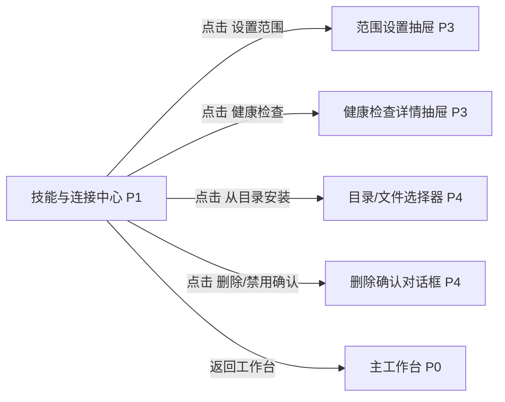

# 技能与连接中心

## 页面目标
- 管理技能、连接、脚本工具和健康检查。

## 进入与退出
- 进入条件：活动栏技能图标或连接图标。
- 退出路径：返回来源页、切换活动栏、命令面板或关闭当前对象。

## 首层显示（小白默认）
- 已安装技能
- 可安装技能
- 已配置连接

## 深层入口（高手）
- 目录安装
- 远程下载
- 健康检查
- 权限边界

## 布局层级
- 顶部筛选
- 左列列表
- 右侧详情/操作区

## 页面低保真示意图
```text
+----------------------------------------------------------------------------------+
| 返回工作台 / 搜索 / 来源筛选 / 已安装-可安装-连接-工具 切换                        |
+-------------------------------+--------------------------------------------------+
| 左侧列表                       | 右侧详情 / 操作区                               |
| 已安装技能                     | 名称 / 来源 / 版本 / 信任等级 / 依赖            |
| 可安装技能                     | [安装] [禁用] [删除] [设置范围]                 |
| 已配置连接                     | 健康检查 / 授权状态 / 最近错误                  |
| 可用脚本工具                   |                                                  |
+-------------------------------+--------------------------------------------------+
```

## 本页跳转层级示意


## 本页调用的功能文档
- [F-081 连接资产管理](../05-功能具体实现方案/05-编排与流程资产/F-081-连接资产管理.md) - A / 部分完成
- [F-082 工具资产管理](../05-功能具体实现方案/05-编排与流程资产/F-082-工具资产管理.md) - A / 部分完成
- [F-095 技能中心查看已装与可装技能](../05-功能具体实现方案/07-技能连接与模型/F-095-技能中心查看已装与可装技能.md) - A / 部分完成
- [F-096 从目录安装技能](../05-功能具体实现方案/07-技能连接与模型/F-096-从目录安装技能.md) - A / 部分完成
- [F-097 从网络下载技能](../05-功能具体实现方案/07-技能连接与模型/F-097-从网络下载技能.md) - A / 未完成
- [F-098 设置技能启用范围（全局/工程/会话）](../05-功能具体实现方案/07-技能连接与模型/F-098-设置技能启用范围（全局-工程-会话）.md) - A / 部分完成
- [F-099 禁用、删除技能与状态反馈](../05-功能具体实现方案/07-技能连接与模型/F-099-禁用、删除技能与状态反馈.md) - A / 部分完成
- [F-100 连接中心健康检查与授权状态](../05-功能具体实现方案/07-技能连接与模型/F-100-连接中心健康检查与授权状态.md) - A / 部分完成
- [F-104 全局通知、空状态、错误态与帮助](../05-功能具体实现方案/08-系统安全与观测/F-104-全局通知、空状态、错误态与帮助.md) - B / 部分完成
- [F-107 导入/安装类功能统一为深层入口](../05-功能具体实现方案/08-系统安全与观测/F-107-导入-安装类功能统一为深层入口.md) - A / 未完成
- [F-108 小白降噪与高手深层入口](../05-功能具体实现方案/08-系统安全与观测/F-108-小白降噪与高手深层入口.md) - S / 未完成
- [F-109 深浅主题与响应式一致性](../05-功能具体实现方案/08-系统安全与观测/F-109-深浅主题与响应式一致性.md) - A / 部分完成

## 交互要求
- 首层只保留当前页面最常用动作，低频动作统一进入更多菜单、右键或命令面板。
- 任何对象级常用动作都应贴近对象本身，而不是放在远处的全局栏位。
- 所有面板、侧栏和抽屉都必须有紧凑宽度策略。
- 安装、导入、授权、删除都是强动作，必须明确它们是 `P3` 还是 `P4`，不能只在文字上说“可用”。
