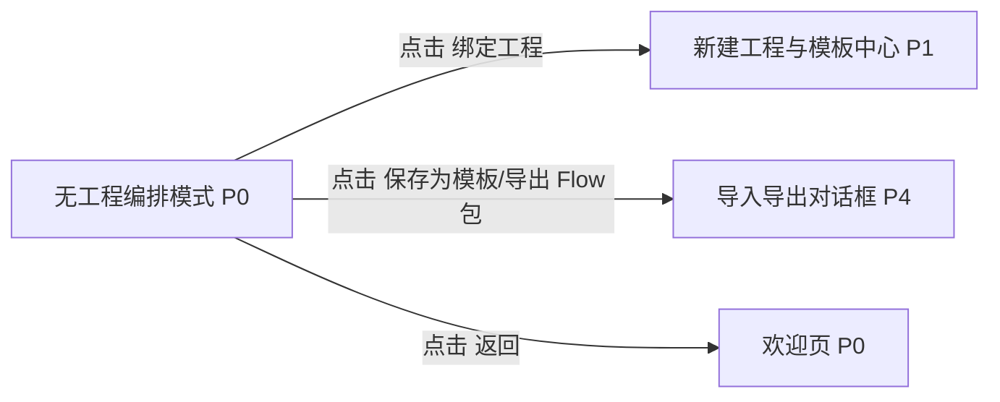

# 无工程编排模式

## 页面目标
- 允许用户在没有工程的情况下，把模糊想法先沉淀成 Flow、Subflow、角色、工件结构和模板草稿。

## 进入与退出
- 进入条件：欢迎页点击进入编排页。
- 退出路径：返回来源页、切换活动栏、命令面板或关闭当前对象。

## 首层显示（小白默认）
- 草稿 Flow 列表
- 模板草稿
- 新建 Flow
- 保存草稿 / 导出 Flow 包

## 深层入口（高手）
- 后续绑定工程
- 迁移到模板中心
- 编辑工件目录、输出契约、角色与模型策略

## 布局层级
- 欢迎头部入口
- 草稿资产栏
- 画布
- 右侧 Inspector

## 页面低保真示意图
```text
+----------------------------------------------------------------------------------+
| 返回欢迎页 / 草稿名称 / 保存草稿 / 绑定工程 / 导出 Flow 包                         |
+----+-------------------------+--------------------------------+------------------+
|草  | 节点库 / 草稿资产        | 画布                           | Inspector         |
|稿  | Flow 草稿 / 模板草稿     | 用户先设计结构，不要求先有工程 | 绑定工程 / 保存模板|
|栏  |                         |                                | 基本元数据         |
+----+-------------------------+--------------------------------+------------------+
```

## 本页跳转层级示意


## 本页调用的功能文档
- [F-005 欢迎页无工程直接进入编排页](../05-功能具体实现方案/01-平台入口与模板/F-005-欢迎页无工程直接进入编排页.md) - S / 未完成
- [F-060 无工程状态进入编排页](../05-功能具体实现方案/05-编排与流程资产/F-060-无工程状态进入编排页.md) - S / 未完成

## 交互要求
- 首层只保留当前页面最常用动作，低频动作统一进入更多菜单、右键或命令面板。
- 任何对象级常用动作都应贴近对象本身，而不是放在远处的全局栏位。
- 所有面板、侧栏和抽屉都必须有紧凑宽度策略。
- 无工程编排模式必须被当作完整 `P0` 页面设计，不是欢迎页上的一个临时覆盖层。
- 无工程编排不是“空工程编辑器”，而是完整的编排草稿生命周期页面，后续必须能衔接模板保存和工程绑定。
