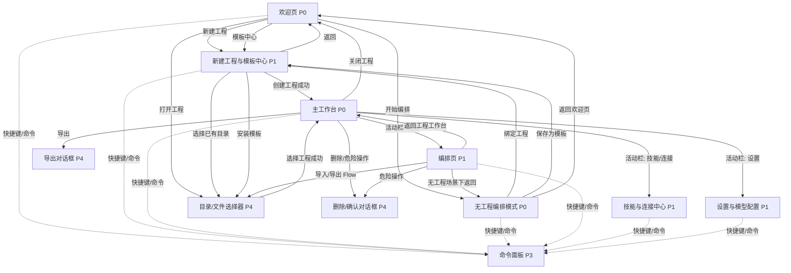
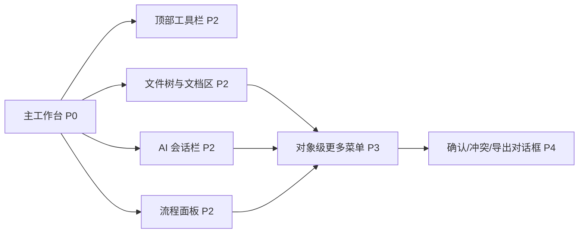
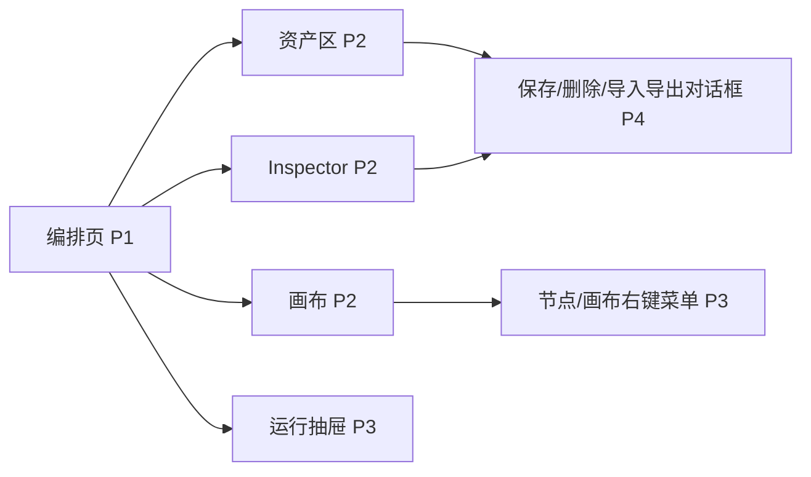

# 全局页面跳转层级图

## 全局关系总图

```mermaid
flowchart TD
    A[欢迎页 P0]
    B[新建工程与模板中心 P1]
    C[主工作台 P0]
    D[无工程编排模式 P0]
    E[编排页 P1]
    F[技能与连接中心 P1]
    G[设置与模型配置 P1]
    H[命令面板 P3]
    I[目录/文件选择器 P4]
    J[删除/确认对话框 P4]
    K[导出对话框 P4]

    A -->|新建工程| B
    A -->|打开工程| I
    I -->|选择工程成功| C
    A -->|开始编排| D
    A -->|模板中心| B

    B -->|创建工程成功| C
    B -->|选择已有目录| I
    B -->|安装模板| I
    B -->|返回| A

    C -->|活动栏: 编排| E
    C -->|活动栏: 技能/连接| F
    C -->|活动栏: 设置| G
    C -->|关闭工程| A
    C -->|导出| K
    C -->|删除/危险操作| J

    D -->|绑定工程| B
    D -->|保存为模板| B
    D -->|返回欢迎页| A

    E -->|返回工程工作台| C
    E -->|无工程场景下返回| D
    E -->|导入/导出 Flow| I
    E -->|危险操作| J

    A -.快捷键/命令.-> H
    B -.快捷键/命令.-> H
    C -.快捷键/命令.-> H
    D -.快捷键/命令.-> H
    E -.快捷键/命令.-> H
    F -.快捷键/命令.-> H
    G -.快捷键/命令.-> H
```

## 主工作台内部分层

```mermaid
flowchart LR
    W[主工作台 P0]
    T[顶部工具栏 P2]
    L[文件树与文档区 P2]
    R[AI 会话栏 P2]
    P[流程面板 P2]
    O[对象级更多菜单 P3]
    D[确认/冲突/导出对话框 P4]

    W --> T
    W --> L
    W --> R
    W --> P
    L --> O
    R --> O
    P --> O
    O --> D
```

## 编排页内部分层

```mermaid
flowchart LR
    E[编排页 P1]
    A[资产区 P2]
    C[画布 P2]
    I[Inspector P2]
    R[运行抽屉 P3]
    M[节点/画布右键菜单 P3]
    D[保存/删除/导入导出对话框 P4]

    E --> A
    E --> C
    E --> I
    E --> R
    C --> M
    A --> D
    I --> D
```

## 约束
- 任何 `P3` 和 `P4` 都不能伪装成一个新的完整页面。
- 任何会替换主内容区的入口，都必须在页面文档中明确标记为 `P0` 或 `P1`。
- 欢迎页、新建工程与模板中心、主工作台、编排页之间的跳转，不能再只靠按钮文案推断。
