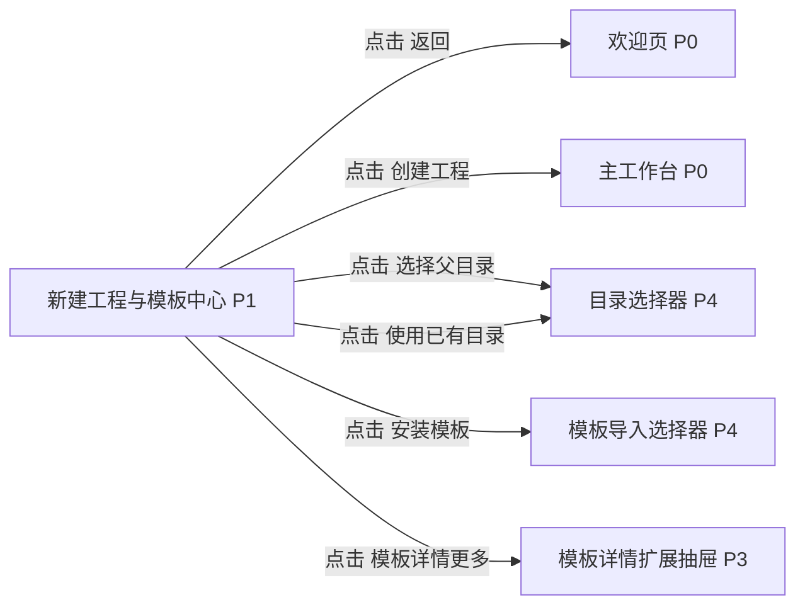

# 新建工程与模板中心

## 页面目标
- 作为“创建工程”主路径的落地页，同时也是模板浏览、复用和回到编排的模板中心。

## 进入与退出
- 进入条件：欢迎页点击新建工程、欢迎页点击模板中心、无工程编排模式点击绑定工程或保存为模板。
- 退出路径：返回来源页、切换活动栏、命令面板或关闭当前对象。

## 首层显示（小白默认）
- 模板搜索与筛选
- 最近模板
- 创建新文件夹
- 使用已有目录
- 返回欢迎页与进入开始编排的清晰返回路径

## 深层入口（高手）
- 导入模板
- 下载模板
- 保存当前工程为模板
- 查看模板来源、版本、兼容性与工件结构

## 布局层级
- 左侧模板列表
- 右侧模板详情
- 底部工程路径与创建表单

## 页面低保真示意图
```text
+----------------------------------------------------------------------------------+
| 返回欢迎页 | 模板搜索 / 筛选                                   安装 / 下载 / 保存 |
+-------------------------------+--------------------------------------------------+
| 模板列表                       | 模板详情                                         |
| [最近模板]                     | 名称 / 说明 / 来源 / 版本 / 工件目录预览         |
| [软件工厂]                     | 默认流程预览 / 最近使用 / 兼容性                 |
| [小说创作]                     |                                                  |
| [旅游攻略]                     |                                                  |
| [视频脚本]                     |                                                  |
+-------------------------------+--------------------------------------------------+
| 目标目录 [选择父目录] [使用已有目录]  工程名 [________]  [创建工程]             |
+----------------------------------------------------------------------------------+
```

## 本页跳转层级示意


## 本页调用的功能文档
- [F-006 新建工程时创建新文件夹](../02-原子功能实现方案/01-平台入口与模板/F-006-新建工程时创建新文件夹.md) - M / 未完成
- [F-007 新建工程时使用已有文件夹](../02-原子功能实现方案/01-平台入口与模板/F-007-新建工程时使用已有文件夹.md) - M / 已完成
- [F-008 新建工程的命名与路径校验](../02-原子功能实现方案/01-平台入口与模板/F-008-新建工程的命名与路径校验.md) - M / 部分完成
- [F-009 从模板创建工程](../02-原子功能实现方案/01-平台入口与模板/F-009-从模板创建工程.md) - M / 已完成
- [F-011 模板中心入口与返回路径](../02-原子功能实现方案/01-平台入口与模板/F-011-模板中心入口与返回路径.md) - A / 部分完成
- [F-012 模板中心搜索筛选](../02-原子功能实现方案/01-平台入口与模板/F-012-模板中心搜索筛选.md) - A / 部分完成
- [F-013 安装/导入模板](../02-原子功能实现方案/01-平台入口与模板/F-013-安装-导入模板.md) - S / 未完成
- [F-014 保存当前工程为模板](../02-原子功能实现方案/01-平台入口与模板/F-014-保存当前工程为模板.md) - S / 部分完成
- [F-107 导入/安装类功能统一为深层入口](../02-原子功能实现方案/08-系统安全与观测/F-107-导入-安装类功能统一为深层入口.md) - A / 未完成

## 交互要求
- 首层只保留当前页面最常用动作，低频动作统一进入更多菜单、右键或命令面板。
- 任何对象级常用动作都应贴近对象本身，而不是放在远处的全局栏位。
- 所有面板、侧栏和抽屉都必须有紧凑宽度策略。
- 模板安装、下载、版本说明、来源信任属于深层动作，不得和“创建工程”竞争首层视觉焦点。
- 模板中心不能被设计成“只有工程创建时才顺便进入一次”的一次性页面，它必须同时服务模板复用和编排复用。

