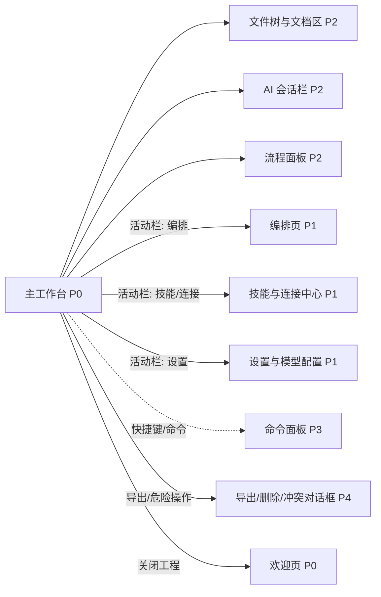

# 主工作台

## 页面目标
- 作为工程内默认工作模式，承载文件、文档、会话与流程面板。

## 进入与退出
- 进入条件：打开工程或创建工程成功后进入。
- 退出路径：返回来源页、切换活动栏、命令面板或关闭当前对象。

## 首层显示（小白默认）
- 顶部对象级高频动作
- 左侧活动栏
- 中间文档
- 右侧 AI 会话栏
- 底部流程面板
- 当前文档的分屏或多窗口入口

## 深层入口（高手）
- 命令面板
- 右键菜单
- 导出与帮助

## 布局层级
- 顶部工具栏
- 左侧活动栏+主侧栏
- 中间内容区
- 右侧会话栏
- 底部流程面板

## 页面低保真示意图
```text
+----------------------------------------------------------------------------------+
| 顶部工具栏：对象级高频动作 / 导出 / 搜索 / 命令面板 / 状态                       |
+----+---------------------------+--------------------------------+-----------------+
|活  | 主侧栏                    | 中间内容区                     | AI 会话栏        |
|动  | 工程 / 搜索 / 编排 / ...  | 当前页面：文档 / 编排 / 中心页 | 当前会话 / 消息  |
|栏  |                           |                                | 输入 / 上下文    |
+----+---------------------------+--------------------------------+-----------------+
| 底部流程面板：阶段、guard、审查、运行记录、确认、导出                            |
+----------------------------------------------------------------------------------+
```

## 本页跳转层级示意


## 本页调用的功能文档
- [F-010 打开已有工程](../02-原子功能实现方案/01-平台入口与模板/F-010-打开已有工程.md) - M / 已完成
- [F-014 保存当前工程为模板](../02-原子功能实现方案/01-平台入口与模板/F-014-保存当前工程为模板.md) - S / 部分完成
- [F-015 最近工程快速重开](../02-原子功能实现方案/02-工程与文件/F-015-最近工程快速重开.md) - M / 已完成
- [F-016 关闭工程与切换工程](../02-原子功能实现方案/02-工程与文件/F-016-关闭工程与切换工程.md) - M / 已完成
- [F-017 打开工程所在目录与导出工程](../02-原子功能实现方案/02-工程与文件/F-017-打开工程所在目录与导出工程.md) - A / 已完成
- [F-030 全局内容搜索定位](../02-原子功能实现方案/02-工程与文件/F-030-全局内容搜索定位.md) - A / 已完成
- [F-059 编排页入口](../02-原子功能实现方案/05-编排与流程资产/F-059-编排页入口.md) - S / 已完成
- [F-092 导出 md/txt/pdf](../02-原子功能实现方案/06-模板工件与导出/F-092-导出md-txt-pdf.md) - S / 已完成
- [F-093 导出 openspec 文件夹](../02-原子功能实现方案/06-模板工件与导出/F-093-导出openspec文件夹.md) - S / 已完成
- [F-094 软件工厂默认模板闭环](../02-原子功能实现方案/06-模板工件与导出/F-094-软件工厂默认模板闭环.md) - S / 部分完成
- [F-103 命令面板与快捷动作](../02-原子功能实现方案/07-技能连接与模型/F-103-命令面板与快捷动作.md) - A / 已完成
- [F-104 全局通知、空状态、错误态与帮助](../02-原子功能实现方案/08-系统安全与观测/F-104-全局通知、空状态、错误态与帮助.md) - B / 部分完成
- [F-105 工作台三栏拖拽与宽度记忆](../02-原子功能实现方案/08-系统安全与观测/F-105-工作台三栏拖拽与宽度记忆.md) - M / 部分完成
- [F-106 顶部工具栏与对象级高频操作](../02-原子功能实现方案/08-系统安全与观测/F-106-顶部工具栏与对象级高频操作.md) - A / 部分完成
- [F-113 多窗口或分屏同时查看多个文件](../02-原子功能实现方案/08-系统安全与观测/F-113-多窗口或分屏同时查看多个文件.md) - A / 未完成
- [F-107 导入/安装类功能统一为深层入口](../02-原子功能实现方案/08-系统安全与观测/F-107-导入-安装类功能统一为深层入口.md) - A / 未完成
- [F-108 小白降噪与高手深层入口](../02-原子功能实现方案/08-系统安全与观测/F-108-小白降噪与高手深层入口.md) - S / 未完成
- [F-109 深浅主题与响应式一致性](../02-原子功能实现方案/08-系统安全与观测/F-109-深浅主题与响应式一致性.md) - A / 部分完成
- [F-110 打包后可启动与基础 smoke 可用](../02-原子功能实现方案/08-系统安全与观测/F-110-打包后可启动与基础smoke可用.md) - M / 已完成

## 交互要求
- 首层只保留当前页面最常用动作，低频动作统一进入更多菜单、右键或命令面板。
- 任何对象级常用动作都应贴近对象本身，而不是放在远处的全局栏位。
- 所有面板、侧栏和抽屉都必须有紧凑宽度策略。
- 从主工作台切换到编排页、技能页、设置页时，只允许替换中间主内容区，不允许把整个应用伪装成新的全屏覆盖层。

