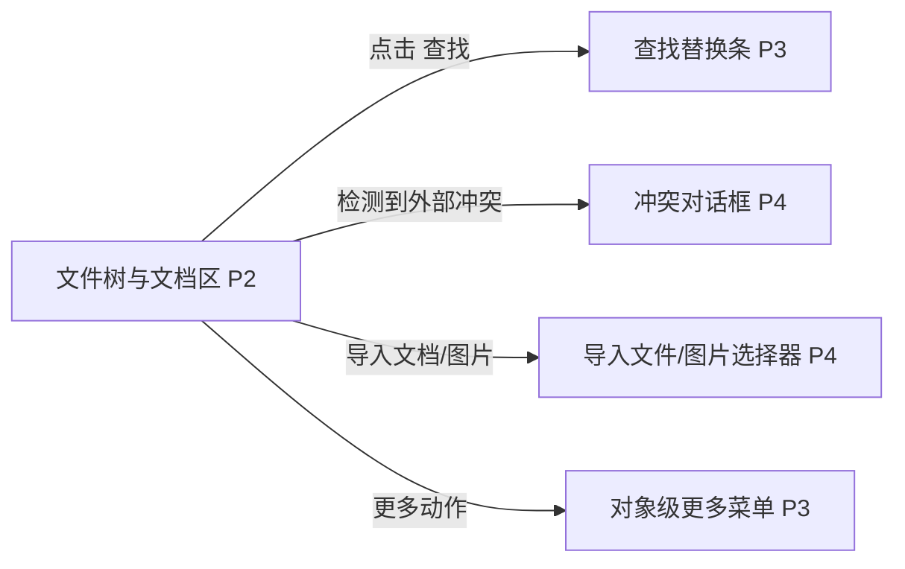

# 文件树与文档区

## 页面目标
- 浏览工程目录并编辑文档、图文块、表格工件与引用关系。

## 进入与退出
- 进入条件：工作台左侧选择工程视图后进入。
- 退出路径：返回来源页、切换活动栏、命令面板或关闭当前对象。

## 首层显示（小白默认）
- 文件树
- 标签栏
- 文档视图切换
- 保存状态
- 引用关系
- 表格工件与图形工件的打开入口

## 深层入口（高手）
- 查找替换
- 右键菜单
- 全局搜索定位

## 布局层级
- 左侧文件树
- 中间标签栏
- 文档头部
- 正文区域
- 底部/侧边引用信息

## 页面低保真示意图
```text
+---------------------------+--------------------------------------------------------+
| 文件树 / 搜索 / 新建      | 标签栏 [文档 A] [文档 B]                               |
| docs/                     +--------------------------------------------------------+
| assets/                   | 面包屑 / 文档标题 / 视图切换 / 保存状态 / 对象动作      |
| 04-详细需求基线.md                +--------------------------------------------------------+
| 05-功能树.md              | 正文区域：Markdown / Mermaid / Mindmap / 框图 / 表格   |
| 06-功能清单.md            |                                                        |
+---------------------------+--------------------------------------------------------+
| 引用关系 / 反向引用 / 引用对比 / 查找替换 / 冲突提示                               |
+------------------------------------------------------------------------------------+
```

## 本页跳转层级示意


## 本页调用的功能文档
- [F-018 文件树浏览与展开](../02-原子功能实现方案/02-工程与文件/F-018-文件树浏览与展开.md) - M / 已完成
- [F-019 文件树搜索与过滤](../02-原子功能实现方案/02-工程与文件/F-019-文件树搜索与过滤.md) - A / 已完成
- [F-020 创建文件夹](../02-原子功能实现方案/02-工程与文件/F-020-创建文件夹.md) - M / 已完成
- [F-021 创建文件](../02-原子功能实现方案/02-工程与文件/F-021-创建文件.md) - M / 已完成
- [F-022 重命名文件或文件夹](../02-原子功能实现方案/02-工程与文件/F-022-重命名文件或文件夹.md) - M / 已完成
- [F-023 删除文件或文件夹](../02-原子功能实现方案/02-工程与文件/F-023-删除文件或文件夹.md) - M / 已完成
- [F-024 移动文件或文件夹](../02-原子功能实现方案/02-工程与文件/F-024-移动文件或文件夹.md) - A / 部分完成
- [F-025 导入外部 Markdown/文本文档](../02-原子功能实现方案/02-工程与文件/F-025-导入外部Markdown-文本文档.md) - A / 已完成
- [F-026 导入外部图片资源](../02-原子功能实现方案/02-工程与文件/F-026-导入外部图片资源.md) - A / 已完成
- [F-027 打开文档](../02-原子功能实现方案/02-工程与文件/F-027-打开文档.md) - M / 已完成
- [F-028 文档标签切换与关闭](../02-原子功能实现方案/02-工程与文件/F-028-文档标签切换与关闭.md) - A / 已完成
- [F-029 面包屑与最近打开文档定位](../02-原子功能实现方案/02-工程与文件/F-029-面包屑与最近打开文档定位.md) - B / 已完成
- [F-030 全局内容搜索定位](../02-原子功能实现方案/02-工程与文件/F-030-全局内容搜索定位.md) - A / 已完成
- [F-031 文档内查找与替换](../02-原子功能实现方案/03-文档编辑与知识关系/F-031-文档内查找与替换.md) - A / 已完成
- [F-032 阅读/编辑/源码视图切换](../02-原子功能实现方案/03-文档编辑与知识关系/F-032-阅读-编辑-源码视图切换.md) - M / 已完成
- [F-033 文本录入与删除](../02-原子功能实现方案/03-文档编辑与知识关系/F-033-文本录入与删除.md) - M / 已完成
- [F-034 复制/剪切/粘贴/撤销/重做](../02-原子功能实现方案/03-文档编辑与知识关系/F-034-复制-剪切-粘贴-撤销-重做.md) - M / 已完成
- [F-035 Markdown 结构化编辑](../02-原子功能实现方案/03-文档编辑与知识关系/F-035-Markdown结构化编辑.md) - A / 部分完成
- [F-036 Mermaid 插入与渲染](../02-原子功能实现方案/03-文档编辑与知识关系/F-036-Mermaid插入与渲染.md) - S / 已完成
- [F-037 思维导图插入与渲染](../02-原子功能实现方案/03-文档编辑与知识关系/F-037-思维导图插入与渲染.md) - S / 已完成
- [F-038 图片粘贴与拖拽导入](../02-原子功能实现方案/03-文档编辑与知识关系/F-038-图片粘贴与拖拽导入.md) - A / 已完成
- [F-111 表格工件浏览与快速编辑](../02-原子功能实现方案/03-文档编辑与知识关系/F-111-表格工件浏览与快速编辑.md) - A / 部分完成
- [F-112 图形/表格工件超链接与嵌入](../02-原子功能实现方案/03-文档编辑与知识关系/F-112-图形-表格工件超链接与嵌入.md) - A / 部分完成
- [F-039 手动保存、自动保存与脏状态提示](../02-原子功能实现方案/03-文档编辑与知识关系/F-039-手动保存、自动保存与脏状态提示.md) - M / 已完成
- [F-040 外部变更检测与冲突处理](../02-原子功能实现方案/03-文档编辑与知识关系/F-040-外部变更检测与冲突处理.md) - A / 已完成
- [F-041 查看笔记正向与反向引用](../02-原子功能实现方案/03-文档编辑与知识关系/F-041-查看笔记正向与反向引用.md) - A / 已完成
- [F-042 对比两篇笔记的引用关系](../02-原子功能实现方案/03-文档编辑与知识关系/F-042-对比两篇笔记的引用关系.md) - B / 已完成
- [F-106 顶部工具栏与对象级高频操作](../02-原子功能实现方案/08-系统安全与观测/F-106-顶部工具栏与对象级高频操作.md) - A / 部分完成

## 交互要求
- 首层只保留当前页面最常用动作，低频动作统一进入更多菜单、右键或命令面板。
- 任何对象级常用动作都应贴近对象本身，而不是放在远处的全局栏位。
- 所有面板、侧栏和抽屉都必须有紧凑宽度策略。
- 文档区内部操作主要是 `P2 -> P3/P4` 层级，不应再打开新的 `P1` 页面。


