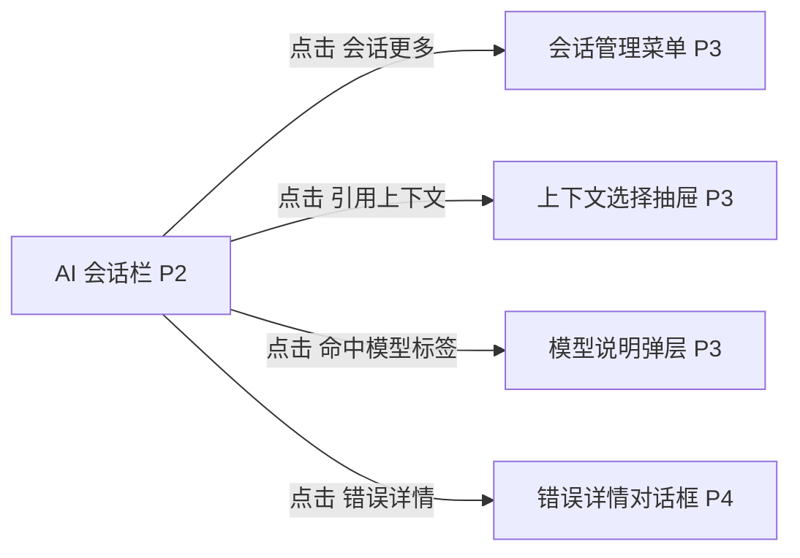

# AI会话栏

## 页面目标
- 管理会话、上下文引用、消息发送和阶段对话。

## 进入与退出
- 进入条件：工作台右侧会话视图。
- 退出路径：返回来源页、切换活动栏、命令面板或关闭当前对象。

## 首层显示（小白默认）
- 当前会话列表
- 消息流
- 输入区
- 上下文引用

## 深层入口（高手）
- 会话管理菜单
- 角色命中模型说明
- 失败重试

## 布局层级
- 会话头部
- 会话列表
- 消息区
- 输入区

## 页面低保真示意图
```text
+------------------------------------------------------------+
| 当前阶段 / 当前会话 / 新建会话 / 会话更多                  |
+------------------------+-----------------------------------+
| 会话列表               | 消息流                             |
| [初始需求会话]         | 用户消息                           |
| [方案规划会话]         | AI 消息 / 运行状态 / 命中模型      |
| [审查会话]             | 红蓝裁判过程块 / 错误重试          |
+------------------------+-----------------------------------+
| 上下文引用：文档 / 图片 / 技能范围 / 模型命中信息          |
+------------------------------------------------------------+
| 输入框 / 发送 / 停止 / 重试                                |
+------------------------------------------------------------+
```

## 本页跳转层级示意


## 本页调用的功能文档
- [F-041 查看笔记正向与反向引用](../02-原子功能实现方案/03-文档编辑与知识关系/F-041-查看笔记正向与反向引用.md) - A / 已完成
- [F-043 会话列表与当前会话切换](../02-原子功能实现方案/04-AI会话与阶段控制/F-043-会话列表与当前会话切换.md) - M / 已完成
- [F-044 新建、重命名、归档和删除会话](../02-原子功能实现方案/04-AI会话与阶段控制/F-044-新建、重命名、归档和删除会话.md) - M / 已完成
- [F-045 发送消息、停止生成与重试](../02-原子功能实现方案/04-AI会话与阶段控制/F-045-发送消息、停止生成与重试.md) - M / 部分完成
- [F-046 选择引用文档与图片上下文](../02-原子功能实现方案/04-AI会话与阶段控制/F-046-选择引用文档与图片上下文.md) - A / 已完成
- [F-047 当前阶段显示与下一步建议](../02-原子功能实现方案/04-AI会话与阶段控制/F-047-当前阶段显示与下一步建议.md) - M / 已完成
- [F-050 生成阶段草稿并写入工件](../02-原子功能实现方案/04-AI会话与阶段控制/F-050-生成阶段草稿并写入工件.md) - S / 部分完成
- [F-051 AI 内部过程显性化展示](../02-原子功能实现方案/04-AI会话与阶段控制/F-051-AI内部过程显性化展示.md) - S / 部分完成
- [F-052 红蓝裁判审查子流程](../02-原子功能实现方案/04-AI会话与阶段控制/F-052-红蓝裁判审查子流程.md) - S / 部分完成
- [F-056 本地 Ollama 连接测试与真实生成](../02-原子功能实现方案/04-AI会话与阶段控制/F-056-本地Ollama连接测试与真实生成.md) - S / 部分完成
- [F-058 角色实际命中模型可见](../02-原子功能实现方案/04-AI会话与阶段控制/F-058-角色实际命中模型可见.md) - A / 部分完成
- [F-098 设置技能启用范围（全局/工程/会话）](../02-原子功能实现方案/07-技能连接与模型/F-098-设置技能启用范围（全局-工程-会话）.md) - A / 部分完成

## 交互要求
- 首层只保留当前页面最常用动作，低频动作统一进入更多菜单、右键或命令面板。
- 任何对象级常用动作都应贴近对象本身，而不是放在远处的全局栏位。
- 所有面板、侧栏和抽屉都必须有紧凑宽度策略。
- AI 会话栏内部不应打开新的完整页面；详情类动作统一进入 `P3/P4`。

