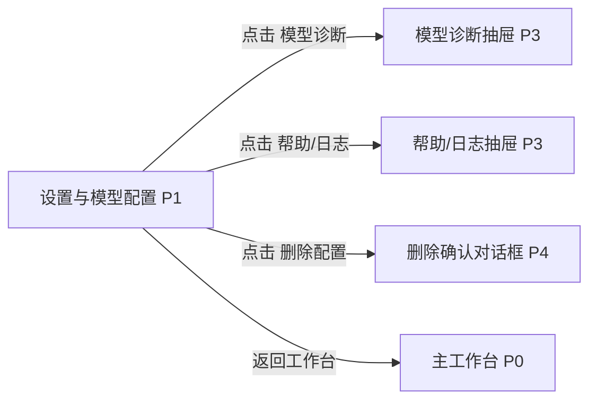

# 设置与模型配置

## 页面目标
- 管理 Provider Profiles、主题、布局和安全设置。

## 进入与退出
- 进入条件：活动栏设置图标或命令面板。
- 退出路径：返回来源页、切换活动栏、命令面板或关闭当前对象。

## 首层显示（小白默认）
- Provider Profiles
- 主题与布局
- 帮助与诊断

## 深层入口（高手）
- 模型能力标签
- 连接测试
- 高级日志入口

## 布局层级
- 左列设置分组
- 右列详情表单

## 页面低保真示意图
```text
+----------------------------------------------------------------------------------+
| 返回工作台 / 设置搜索 / 帮助 / 诊断                                               |
+-----------------------------+----------------------------------------------------+
| 左列设置分组                | 右列详情表单                                       |
| Provider Profiles           | 配置名称 / Provider / Base URL / Model / API Key   |
| 主题与布局                  | 能力标签 / 连通性诊断 / 立即激活说明               |
| 安全与存储                  | 主题、布局、日志、帮助                             |
+-----------------------------+----------------------------------------------------+
```

## 本页跳转层级示意


## 本页调用的功能文档
- [F-055 Provider 选择即激活](../02-原子功能实现方案/04-AI会话与阶段控制/F-055-Provider选择即激活.md) - M / 已完成
- [F-056 本地 Ollama 连接测试与真实生成](../02-原子功能实现方案/04-AI会话与阶段控制/F-056-本地Ollama连接测试与真实生成.md) - S / 部分完成
- [F-057 DeepSeek/OpenAI-compatible 配置](../02-原子功能实现方案/04-AI会话与阶段控制/F-057-DeepSeek-OpenAI-compatible配置.md) - M / 已完成
- [F-058 角色实际命中模型可见](../02-原子功能实现方案/04-AI会话与阶段控制/F-058-角色实际命中模型可见.md) - A / 部分完成
- [F-101 Provider Profiles 增删改查](../02-原子功能实现方案/07-技能连接与模型/F-101-ProviderProfiles增删改查.md) - M / 已完成
- [F-102 模型能力标签与诊断显示](../02-原子功能实现方案/07-技能连接与模型/F-102-模型能力标签与诊断显示.md) - A / 部分完成
- [F-103 命令面板与快捷动作](../02-原子功能实现方案/07-技能连接与模型/F-103-命令面板与快捷动作.md) - A / 已完成
- [F-104 全局通知、空状态、错误态与帮助](../02-原子功能实现方案/08-系统安全与观测/F-104-全局通知、空状态、错误态与帮助.md) - B / 部分完成
- [F-109 深浅主题与响应式一致性](../02-原子功能实现方案/08-系统安全与观测/F-109-深浅主题与响应式一致性.md) - A / 部分完成

## 交互要求
- 首层只保留当前页面最常用动作，低频动作统一进入更多菜单、右键或命令面板。
- 任何对象级常用动作都应贴近对象本身，而不是放在远处的全局栏位。
- 所有面板、侧栏和抽屉都必须有紧凑宽度策略。
- 设置页里的诊断和帮助属于 `P3` 深层说明，不应把配置主表单挤出首屏。

