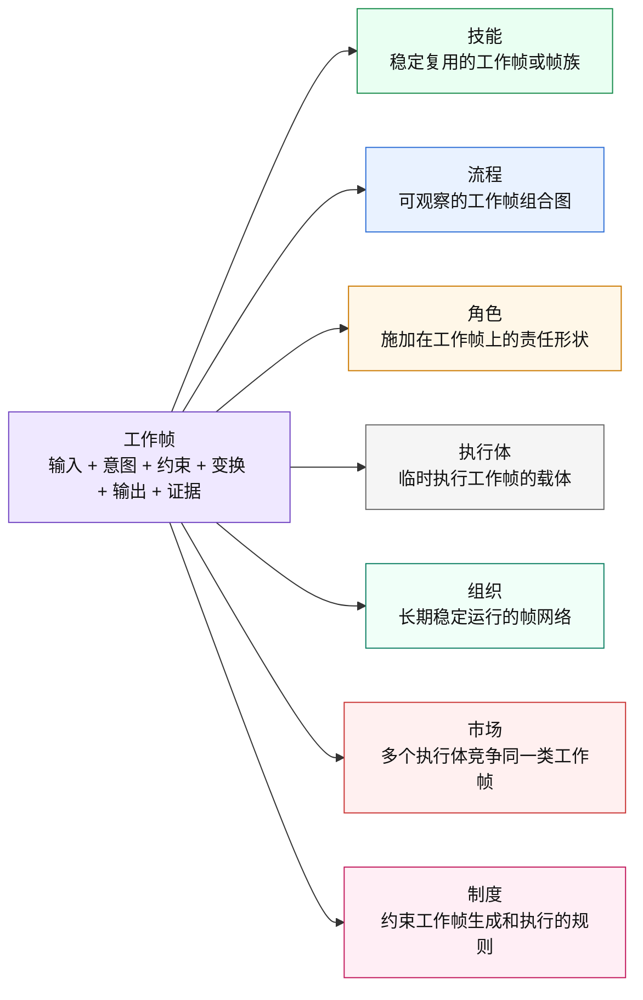
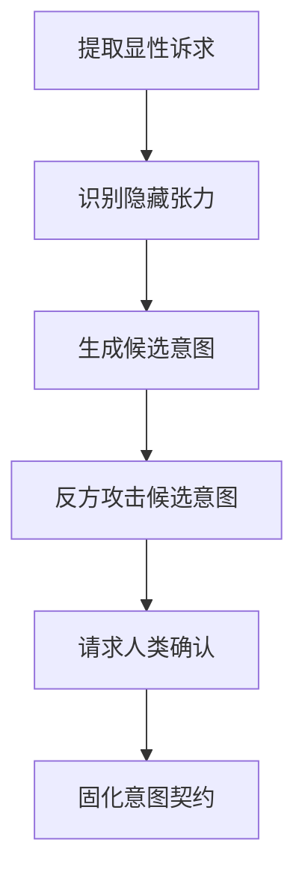
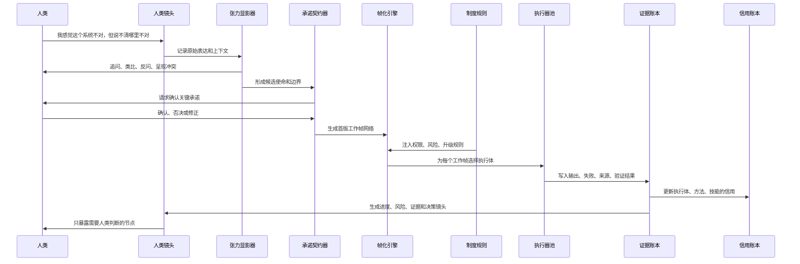
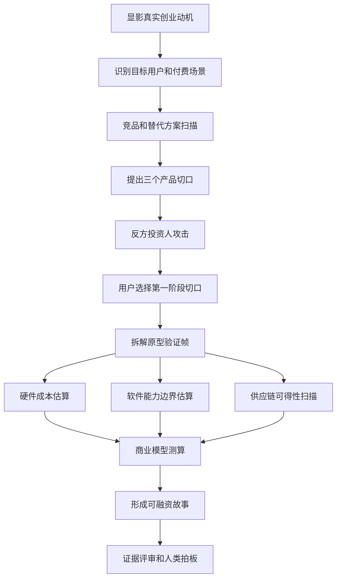
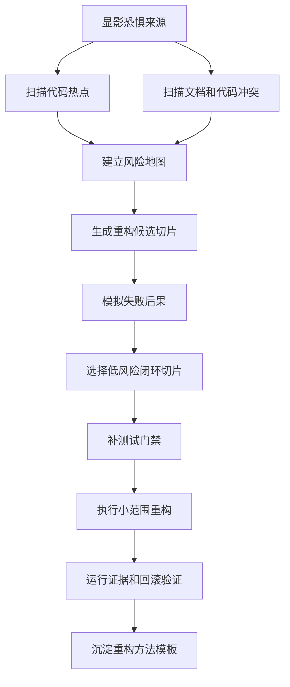
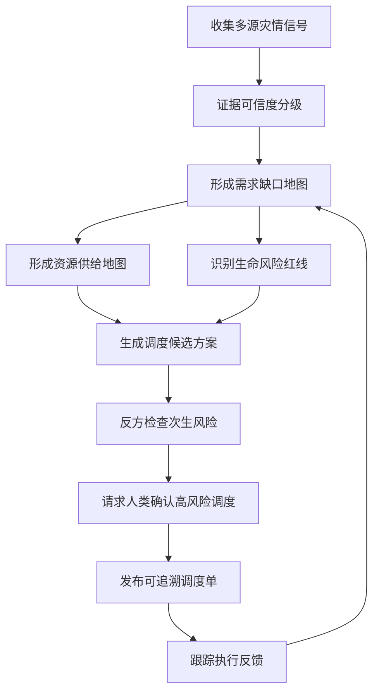
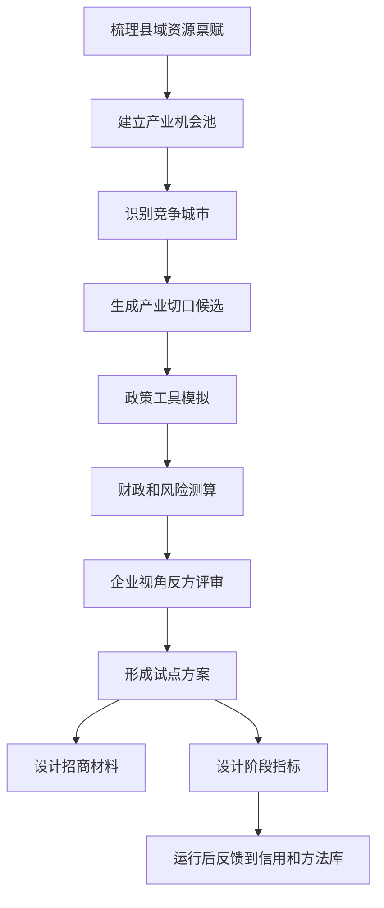
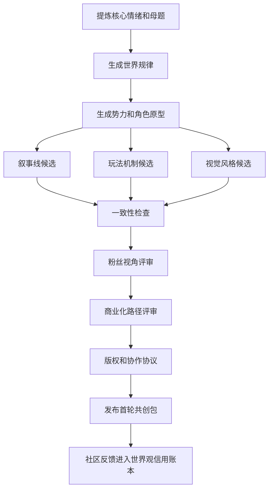

# 02 人工智能软件社会帧元架构导览

> 阅读目的：用图文方式解释一套未来重构参考架构。它不从“角色、智能体、流程、技能”出发，而从一个更小的生成元出发，说明复杂人工智能组织如何一生二、二生三、三生万物。
>
> 文档状态：探索型参考架构，不代表当前代码已经实现；不得用本文替代 `docs/03-架构实现/` 中的当前实现口径。若未来进入实现，必须先形成正式变更、补齐数据契约、运行时语义、测试门禁和迁移计划。

## 0. 一句话

我们不是要复制人类公司，也不是要做一个更复杂的工作流软件。

我们要设计的是：

> 一个文件驱动的人工智能软件社会，把人类模糊需求转化为可组合、可执行、可验证、可演化的“工作帧网络”，让模型、工具、人类、流程、技能、角色和组织都从同一个简单生成元中长出来。

核心判断：

```text
不是先定义角色。
不是先定义智能体。
不是先定义流程。
不是先定义技能。

先定义“工作帧”。
```

## 1. 为什么不能从角色、智能体、流程开始

### 1.1 角色不是根

角色表达职责、权限、判断标准和交付边界，但角色本身不产出结果。

```text
角色 = 责任形状
不是执行实体
不是工作本体
```

一个“调度者”可以是角色，一个“审查者”也可以是角色。把它们做成独立一级模块，会把特殊岗位误当成系统物理规则。

### 1.2 智能体不是根

智能体容易被误认为“人工智能版员工”。但人工智能和人类不同：

- 模型可以瞬时复制。
- 一个模型可同时扮演多个视角。
- 一个任务可以由多个临时计算切片共同完成。
- 记忆、权限、技能、角色、身份、信用都可以拆开。
- 执行者可以在运行时晚绑定，而不是一开始固定。

所以智能体只是执行载体，不是系统根对象。

### 1.3 流程不是根

流程适合表达顺序、分支、循环、并行和人工介入，但它容易把“过程”误当成“目标”。

人工智能任务经常是探索式、对抗式、演化式的；完整流程往往不是预先固定，而是运行中生成、修改、压缩、展开。

```text
流程 = 展开的组织形态
不是最终真相
```

### 1.4 技能不是根

技能是可复用能力接口。它可以很小，也可以把复杂流程封装成黑盒。

但如果技能成为根对象，就会把“如何调用一个能力”误当成“系统如何组织复杂协作”。

```text
技能 = 可复用调用形态
不是所有组织关系的源头
```

## 2. 总图：从人类愿望到工作帧网络

```mermaid
flowchart TB
  人类["人类<br/>愿望 / 品味 / 价值 / 授权 / 责任"]:::human

  张力["张力场<br/>痛点 / 模糊感受 / 冲突 / 未说清的问题"]:::signal
  使命["使命<br/>这次到底要推进什么"]:::mission
  承诺["承诺契约<br/>系统承诺交付什么、边界是什么"]:::contract

  帧化["帧化引擎<br/>把模糊使命切成工作帧"]:::core
  帧图["工作帧网络<br/>可组合 / 可展开 / 可压缩 / 可演化"]:::graph

  执行池["执行器池<br/>大模型 / 小模型 / 工具 / 脚本 / 人类 / 外部服务"]:::executor
  产物["产物<br/>文档 / 代码 / 方案 / 数据 / 决策建议"]:::artifact
  证据["证据账本<br/>事实 / 来源 / 过程 / 验收 / 失败"]:::evidence
  信用["信用账本<br/>表现 / 成本 / 稳定性 / 风险记录"]:::credit
  镜头["人类镜头<br/>进度 / 风险 / 决策点 / 证据 / 组织状态"]:::lens

  制度["制度规则<br/>权限 / 风险阈值 / 升级条件 / 不可越界事项"]:::policy

  人类 --> 张力 --> 使命 --> 承诺 --> 帧化 --> 帧图
  帧图 --> 执行池 --> 产物 --> 证据 --> 镜头 --> 人类
  证据 --> 信用 --> 帧图
  制度 --> 承诺
  制度 --> 帧图
  制度 --> 执行池
  制度 --> 证据

  classDef human fill:#fff3d6,stroke:#c48a00,color:#111;
  classDef signal fill:#fff7e8,stroke:#cc7a00,color:#111;
  classDef mission fill:#e9f2ff,stroke:#2f6fd6,color:#111;
  classDef contract fill:#efe8ff,stroke:#6f42c1,color:#111;
  classDef core fill:#f0e9ff,stroke:#6f42c1,color:#111;
  classDef graph fill:#e9fff2,stroke:#168a4a,color:#111;
  classDef executor fill:#f5f5f5,stroke:#666,color:#111;
  classDef artifact fill:#eef9ff,stroke:#168aad,color:#111;
  classDef evidence fill:#e8f7ff,stroke:#168aad,color:#111;
  classDef credit fill:#f0fff8,stroke:#0d7f63,color:#111;
  classDef lens fill:#fff0f0,stroke:#c93333,color:#111;
  classDef policy fill:#ffeef5,stroke:#c2185b,color:#111;
```

## 3. 最小生成元：工作帧

### 3.1 定义

工作帧是人工智能软件社会的最小生成元：

> 在给定输入中，为了某个意图，遵守某些约束，使用某种变换，产生可验收输出，并留下证据。

```text
工作帧 = 输入 + 意图 + 约束 + 变换 + 输出 + 证据
```

这六项足够小，但可以长出角色、技能、流程、组织、市场和制度。

### 3.2 工作帧卡片

| 部分 | 中文名 | 作用 | 必须回答的问题 |
|---|---|---|---|
| 输入 | 输入材料 | 当前能看到什么 | 信息从哪里来，可信度如何 |
| 意图 | 局部意图 | 这一帧要推进什么 | 为什么要做这一小步 |
| 约束 | 规则边界 | 什么不能做，什么必须满足 | 权限、成本、风险、格式、时间边界是什么 |
| 变换 | 履约方法 | 如何把输入变成输出 | 用推理、工具、检索、脚本、流程还是人类判断 |
| 输出 | 交付结果 | 这一帧交付什么 | 给谁用，下游如何消费 |
| 证据 | 验收依据 | 为什么相信它完成了 | 来源、检查、测试、评审、用户确认在哪里 |

### 3.3 工作帧不是任务标题

错误写法：

```text
工作帧：分析市场
```

正确写法：

```text
工作帧：提取目标市场的前三类高频付费痛点
输入：用户设想、竞品列表、公开评论、行业报告
意图：判断需求是否真实存在
约束：必须保留来源；不得把单条评论当成普遍结论
变换：评论聚类、痛点归因、反例扫描
输出：痛点清单、出现频率、证据链接、反例
证据：来源片段、聚类规则、审查意见
```

## 4. 一生二：工作帧如何长出对象



### 4.1 对象速查

| 对象 | 从工作帧如何长出来 | 能做什么 | 不能做什么 |
|---|---|---|---|
| 技能 | 被反复验证、输入输出稳定的工作帧 | 作为黑盒能力被调用 | 不负责展开内部协作细节 |
| 流程 | 多个工作帧按依赖、分支、循环、并行连接 | 展示过程、暂停、重试、审计、人工介入 | 不应成为所有任务的唯一组织方式 |
| 角色 | 给工作帧施加职责、权限、判断标准和升级条件 | 约束执行者如何履约 | 不直接执行工作 |
| 执行体 | 被选中来执行某个工作帧的模型、工具、人或服务 | 运行变换、产生输出 | 不拥有系统真相 |
| 组织 | 长期稳定的工作帧网络，加上角色、制度、信用 | 持续承接某类复杂使命 | 不等于固定流程 |
| 市场 | 多个执行体或方案竞争同一类工作帧 | 通过证据和信用筛选更优履约者 | 不替代制度治理 |
| 制度 | 约束工作帧如何生成、执行、升级、验证 | 保证安全、边界和责任 | 不生产业务产物 |

## 5. 流程是否可以用技能代替

答案分两层：

```text
对上层调用者：可以。
对系统运行时：不能完全替代。
```

### 5.1 什么时候流程可以表现为技能

当调用者只关心输入输出时，流程可以封装成技能。


此时内部可以有追问、归纳、反方攻击、用户确认，但外部只看到：

```text
输入 -> 技能 -> 输出
```

### 5.2 什么时候必须展开为流程

当系统需要以下能力时，不能只用技能黑盒：

- 过程可观察。
- 中途暂停。
- 人类拍板。
- 多执行体并行。
- 失败重试。
- 责任归因。
- 证据审计。
- 下游依赖局部结果。

这时必须展开成流程。



### 5.3 更准确的关系

```text
技能 = 工作帧的黑盒复用形态
流程 = 工作帧的白盒组织形态
```

一个流程可以被封装成技能。
一个技能也可以在调试、审计或高风险场景中展开成流程。
两者都不是根，根是工作帧。

## 6. 从人类社会吸收灵感，但不照抄人类社会

### 6.1 人类为什么需要“人”作为承载体

人类天然把很多东西绑定在一个身体里：

```text
身体
大脑
精力
记忆
知识
技能
方法论
情绪
信用
身份
责任
关系
```

所以人类社会以“人”为基本协作单位。

### 6.2 人工智能不需要这样绑定

人工智能的这些要素可以拆开：

```text
模型能力可以换。
记忆可以换。
角色可以换。
技能可以换。
工具可以换。
权限可以换。
方法论可以换。
执行者可以晚绑定。
同一个视角可以复制成多个并行副本。
多个互相攻击的视角可以同时存在。
```

所以人工智能软件社会不应该一味模拟公司员工，而应该利用人工智能的可拆解性。

### 6.3 关键转变

```text
人类社会：主体稳定，能力附着在主体上。
人工智能软件社会：工作帧稳定，执行体临时绑定。
```

这意味着：

- 不是先找“谁”来做，而是先定义“要完成什么状态变换”。
- 不是让某个智能体长期拥有所有上下文，而是给每个工作帧挂载最小必要上下文。
- 不是让一个角色包办到底，而是按工作帧动态绑定角色形状。
- 不是沉淀固定流程，而是沉淀可复用工作帧、方法、标准、证据和信用。

## 7. 牛人能力如何映射到人工智能软件社会

你提出的四类牛，应该被保留，但不能直接做成角色字段。它们更像执行体和工作帧的能力坐标。

| 人类牛的来源 | 人工智能软件社会中的对应物 | 如何使用 |
|---|---|---|
| 硬件牛 | 执行器能力画像 | 决定用大模型、小模型、工具、人类还是组合执行 |
| 技能牛 | 技能库、知识库、工具库 | 作为工作帧的可选变换资源 |
| 方法论牛 | 方法模板、判断框架、复盘规则 | 指导工作帧如何拆解、验证、迭代 |
| 对齐牛 | 张力显影、意图澄清、上游同步规则 | 降低人类意图到产物之间的信息损耗 |
| 资源网络牛 | 执行器市场、外部服务、专家连接 | 让系统能调用自己不具备的能力 |
| 反馈环境牛 | 证据账本、评审、信用、失败复盘 | 让系统持续变得更可靠 |

牛人不是一个对象。
牛人是这些能力在一个人身上的高密度绑定。
人工智能软件社会可以把这些能力拆开、组合、复制、竞争、审查。

## 8. 核心运行机制

### 8.1 从一句模糊话到可运行帧网络



### 8.2 主循环

```text
接收人类表达
  -> 显影张力
  -> 形成使命
  -> 建立承诺契约
  -> 生成工作帧网络
  -> 绑定角色形状
  -> 选择执行器
  -> 执行工作帧
  -> 写入证据
  -> 验收输出
  -> 更新信用
  -> 调整工作帧网络
  -> 必要时请求人类决策
```

### 8.3 人类什么时候介入

人类不是每一步都审批。人类只在价值、授权和不可逆风险处介入。

| 介入原因 | 判断标准 | 系统动作 |
|---|---|---|
| 价值判断 | 涉及“什么更重要” | 暂停并给出选项 |
| 高成本 | 消耗大量钱、时间或资源 | 请求授权 |
| 不可逆 | 会删除、发布、付款、提交、通知外部对象 | 强制确认 |
| 低置信 | 证据不足或执行体分歧大 | 汇报分歧和建议 |
| 越权风险 | 超出角色、技能或工具权限 | 阻断并升级 |
| 目标漂移 | 工作帧网络偏离承诺契约 | 请求重新对齐 |

## 9. 核心对象卡片

### 9.1 人类愿望

| 项 | 内容 |
|---|---|
| 它是什么 | 人类想改变世界、解决痛点、创造价值的源头。 |
| 它提供 | 品味、价值、授权、责任、最终裁决。 |
| 它不提供 | 完整任务说明、完整流程、专业交付标准。 |

### 9.2 张力场

| 项 | 内容 |
|---|---|
| 它是什么 | 从模糊表达、反复否定、犹豫、恐惧、冲突中显影出来的问题结构。 |
| 它提供 | 痛点、阻力、真实期待、未说出口的边界。 |
| 它不做 | 不直接承诺解决方案。 |

### 9.3 使命

| 项 | 内容 |
|---|---|
| 它是什么 | 本次系统要推动的方向。 |
| 它提供 | 目标重心和优先级。 |
| 它不做 | 不规定具体执行步骤。 |

### 9.4 承诺契约

| 项 | 内容 |
|---|---|
| 它是什么 | 系统对人类做出的交付承诺、边界承诺和升级承诺。 |
| 它提供 | 交付物、验收方式、权限边界、失败处理。 |
| 它不做 | 不直接执行。 |

### 9.5 工作帧

| 项 | 内容 |
|---|---|
| 它是什么 | 输入、意图、约束、变换、输出、证据组成的最小生成元。 |
| 它提供 | 可执行、可验证、可组合的基本单位。 |
| 它不做 | 不强迫自己一定是角色、技能或流程。 |

### 9.6 工作帧网络

| 项 | 内容 |
|---|---|
| 它是什么 | 多个工作帧组成的动态图。 |
| 它提供 | 顺序、依赖、并行、竞争、审查、回退、人工介入。 |
| 它不做 | 不等同于固定流程模板。 |

### 9.7 角色形状

| 项 | 内容 |
|---|---|
| 它是什么 | 施加在工作帧执行上的责任、权限、判断标准和升级条件。 |
| 它提供 | 谁能做什么、按什么标准做、什么时候上报。 |
| 它不做 | 不代表一个固定智能体。 |

### 9.8 技能模板

| 项 | 内容 |
|---|---|
| 它是什么 | 被反复证明有效、可复用调用的工作帧或帧族。 |
| 它提供 | 稳定输入输出、成本预期、适用边界。 |
| 它不做 | 不负责所有过程可见性。 |

### 9.9 流程模板

| 项 | 内容 |
|---|---|
| 它是什么 | 可展开观察的工作帧组合结构。 |
| 它提供 | 可调试、可恢复、可审计的过程控制。 |
| 它不做 | 不应成为唯一抽象。 |

### 9.10 执行器

| 项 | 内容 |
|---|---|
| 它是什么 | 运行某个工作帧的模型、工具、脚本、人类或外部服务。 |
| 它提供 | 实际计算、检索、执行和判断能力。 |
| 它不做 | 不拥有长期系统真相。 |

### 9.11 制度规则

| 项 | 内容 |
|---|---|
| 它是什么 | 权限、风险、升级、审计、资源使用和安全边界。 |
| 它提供 | 行为边界和组织秩序。 |
| 它不做 | 不生产业务内容。 |

### 9.12 证据账本

| 项 | 内容 |
|---|---|
| 它是什么 | 工作帧执行后的事实记录。 |
| 它提供 | 来源、输入、输出、执行体、检查、失败、验收依据。 |
| 它不做 | 不等同于普通日志，也不允许执行体随意改写。 |

### 9.13 信用账本

| 项 | 内容 |
|---|---|
| 它是什么 | 方法、技能、执行器、角色形状在历史工作帧中的表现记录。 |
| 它提供 | 未来分配、竞标、降级、淘汰、推荐依据。 |
| 它不做 | 不替代本次证据验收。 |

### 9.14 人类镜头

| 项 | 内容 |
|---|---|
| 它是什么 | 把复杂工作帧网络投影成人类能看懂的状态视图。 |
| 它提供 | 进度、风险、关键决策、证据、组织状态、异常。 |
| 它不做 | 不拥有真相，不绕过证据账本。 |

## 10. 文件驱动形态

> 文件名只是未来设计草案，用于说明对象关系；不代表当前工程已经采用该目录。

```text
.软件社会/
  使命/
    当前使命.yaml
    张力场.yaml
    承诺契约.yaml

  帧库/
    工作帧/
    技能模板/
    流程模板/
    方法模板/
    角色形状/

  运行/
    工作帧网络.yaml
    执行中/
    暂停中/
    失败中/
    已完成/

  执行器/
    模型画像/
    工具画像/
    人类协作/
    外部服务/

  治理/
    制度规则.yaml
    权限记录/
    升级记录/
    风险阈值/

  证据/
    账本/
    来源/
    检查/
    评审/
    失败/

  信用/
    执行器信用/
    技能信用/
    方法信用/
    角色信用/

  镜头/
    老板镜头/
    执行镜头/
    风险镜头/
    证据镜头/
    组织镜头/
```

## 11. 五个极端复杂案例

### 11.1 案例一：一个普通人发起机器人创业公司

#### 复杂性

用户只有一句话：

> 我想做一个能赚钱的家用机器人，但我不懂硬件、供应链、融资、法规和市场。

这里同时涉及：

- 市场洞察。
- 产品定位。
- 硬件设计。
- 软件架构。
- 供应链。
- 成本核算。
- 法规安全。
- 融资材料。
- 用户测试。
- 团队搭建。

#### 工作帧网络



#### 角色形状

| 角色形状 | 负责 | 不负责 |
|---|---|---|
| 创业意图访谈者 | 找出用户真正想要的事业形态 | 不替用户决定人生选择 |
| 市场侦察者 | 找证据证明需求存在或不存在 | 不写融资故事 |
| 反方投资人 | 攻击商业假设 | 不负责鼓励用户 |
| 硬件供应链顾问 | 估算物料、制造、交期风险 | 不做最终采购 |
| 产品架构师 | 把愿景切成可验证原型 | 不隐瞒技术债 |

#### 先进性体现

传统流程会让用户先填商业计划书。
工作帧架构先显影张力，再动态生成创业组织。

优势：

- 不需要用户懂创业流程。
- 不固定从市场、产品、技术哪一端开始。
- 可以让多个方案并行竞争。
- 关键风险自动升级给人类。
- 每个商业判断必须带证据，不允许空喊愿景。

### 11.2 案例二：百万行老系统重构

#### 复杂性

用户说：

> 这个系统太乱了，我想重构，但怕一改就炸。

真实问题可能包括：

- 架构边界腐烂。
- 测试缺失。
- 文档失真。
- 数据迁移风险。
- 团队没人敢负责。
- 业务仍在运行。
- 上游下游依赖不清。

#### 工作帧网络



#### 工作帧示例

| 工作帧 | 输入 | 输出 | 证据 |
|---|---|---|---|
| 扫描代码热点 | 代码变更历史、文件大小、引用关系 | 热点清单 | 文件路径、复杂度、调用证据 |
| 找文档漂移 | 文档声明、代码实际入口 | 冲突表 | 文档段落、代码 owner |
| 设计切片 | 风险地图、测试现状 | 重构切片方案 | 回滚路径、验证命令 |
| 审查切片 | 切片方案 | 反方问题清单 | 失败场景和影响范围 |

#### 先进性体现

传统工作流会提前定义“调研、设计、开发、测试”。
工作帧架构会先找系统真正害怕什么，再决定怎么拆。

优势：

- 不把“重构”当单一大任务。
- 每一步都有可验证输出。
- 大模型负责结构判断，小模型负责扫描和归类。
- 人类只在架构取舍、风险授权处介入。
- 成功切片会沉淀为未来重构技能模板。

### 11.3 案例三：跨城市灾害救援调度

#### 复杂性

用户是临时救援协调者：

> 三个城市同时受灾，物资、车辆、志愿者、医院容量都在变化，我要知道先救哪里、调什么、怎么避免乱。

涉及：

- 多地实时数据。
- 道路通行。
- 医疗容量。
- 物资库存。
- 志愿者能力。
- 谣言和错误信息。
- 政府指令。
- 高风险生命决策。

#### 工作帧网络



#### 制度规则

| 规则 | 作用 |
|---|---|
| 生命风险优先 | 任何低价值目标不得压过生命风险 |
| 来源分级 | 未验证消息不能直接触发高风险调度 |
| 人类强制确认 | 涉及救援优先级和资源冲突时必须升级 |
| 追溯要求 | 每个调度建议必须说明数据来源和假设 |

#### 先进性体现

这里不能用固定流程，也不能完全自动化。
系统必须动态生成帧网络，并持续根据新证据改写。

优势：

- 谣言不会直接进入行动。
- 高风险决策不会被人工智能偷偷执行。
- 多方案可以并行评估。
- 下游执行反馈会回流到需求地图。
- 证据账本支持事后复盘和责任追踪。

### 11.4 案例四：县域新能源产业政策与招商

#### 复杂性

用户是地方发展负责人：

> 我们县想发展新能源产业，但不知道该押储能、光伏配套、运维服务、还是算力能源协同。

涉及：

- 资源禀赋。
- 财政能力。
- 产业链位置。
- 招商对象。
- 政策工具。
- 人才供给。
- 环保约束。
- 周边城市竞争。
- 长周期经济反馈。

#### 工作帧网络



#### 人类介入点

| 介入点 | 原因 |
|---|---|
| 选择产业切口 | 涉及长期价值和政治责任 |
| 批准政策工具 | 涉及财政和市场公平 |
| 确认招商承诺 | 涉及外部承诺和声誉 |
| 评估试点结果 | 涉及是否扩大投入 |

#### 先进性体现

传统咨询项目往往产出一份大报告。
工作帧架构产出的是可运行的政策学习系统。

优势：

- 把“产业发展”拆成证据驱动的连续试点。
- 政策不是一次性报告，而是可跟踪工作帧网络。
- 企业、政府、居民、环保等视角可以互相攻击。
- 每次试点表现进入信用账本，影响下一轮政策。
- 人类保留价值判断，人工智能承担繁重分析、模拟和追踪。

### 11.5 案例五：多个超级个体联合创造大型世界观产品

#### 复杂性

用户说：

> 我想做一个跨小说、游戏、短剧、社区共创的大型世界观，但我只有一个核心灵感。

涉及：

- 世界观设定。
- 角色体系。
- 叙事主线。
- 游戏机制。
- 视觉风格。
- 商业化路径。
- 粉丝社区。
- 版权授权。
- 多创作者协作。
- 长期一致性。

#### 工作帧网络



#### 工作帧如何支持多人协作

| 问题 | 工作帧方案 |
|---|---|
| 多创作者风格冲突 | 每个创作帧必须声明母题、约束和一致性证据 |
| 世界观越写越乱 | 世界规律作为高优先级约束注入下游帧 |
| 用户不知道该先做什么 | 先做情绪、母题、世界规律，再展开产品形态 |
| 社区共创失控 | 共创输入先进入证据和信用，不直接改核心设定 |
| 商业和艺术冲突 | 商业评审帧与艺术评审帧并行，最后由人类裁决 |

#### 先进性体现

传统工具只帮你写文案或画设定图。
工作帧架构能组织一个创作社会。

优势：

- 创作不是单次生成，而是长期演化。
- 多个创作者和人工智能可以围绕同一世界规律协作。
- 每个设定都有来源、约束和一致性检查。
- 用户保留审美和灵魂，不被模型平均化。
- 社区贡献可以被吸收，但不会污染核心真相。

## 12. 为什么这套架构更先进

| 对比项 | 传统工作流 | 智能体平台 | 工作帧架构 |
|---|---|---|---|
| 核心单位 | 固定流程节点 | 智能体 | 工作帧 |
| 组织方式 | 人先画流程 | 人先配智能体 | 系统从使命动态生成帧网络 |
| 复用资产 | 流程模板 | 角色和提示词 | 工作帧、方法、技能、证据、信用 |
| 适应新任务 | 需要新流程 | 需要新智能体 | 生成新帧图，复用旧帧族 |
| 人类位置 | 流程操作者 | 智能体管理者 | 价值源、授权者、最终责任人 |
| 质量控制 | 节点成功即成功 | 智能体自称完成 | 证据验收和信用回流 |
| 人工智能特殊性 | 利用不足 | 部分利用 | 充分利用拆分、复制、并行、竞争、晚绑定 |

## 13. 反向检查

如果未来设计又开始变复杂，用这张表检查：

| 问题 | 如果答不上来，说明设计在退化 |
|---|---|
| 最小工作帧是什么 | 答不上来说明任务仍然太空 |
| 输入、意图、约束、变换、输出、证据是否齐全 | 缺一项就不可执行或不可验收 |
| 这个对象是根对象，还是工作帧长出的稳定形态 | 分不清就会制造万能筐 |
| 流程为什么必须展开 | 如果只是输入输出调用，应该先封装成技能 |
| 技能什么时候必须展开成流程 | 如果需要审计、暂停、人工决策，就必须展开 |
| 执行器为什么是这个 | 如果不能说明成本、能力、信用，就不是理性调度 |
| 人类为什么要介入 | 如果不是价值、授权、不可逆风险，就可能过度打扰 |
| 证据写在哪里 | 没有证据就没有完成 |
| 信用如何回流 | 不回流就不能持续变强 |
| 哪些内容不代表当前代码已实现 | 不标清就会污染当前文档真相 |

## 14. 与当前 Cyber Editor 的关系

本文是未来重构参考，不改变当前实现事实：

- 当前正式代码分层仍以 `docs/03-架构实现/01-系统架构与分层Owner.md` 为准。
- 当前编排运行时仍以 `docs/03-架构实现/02-AI编排运行时.md` 为准。
- 当前功能范围仍以 `docs/01-需求与PRD/06-功能清单.md` 为准。
- 当前测试验收仍以 `docs/04-测试验收/` 为准。

如果未来采纳本文方向，建议迁移路线不是一次性推翻现有系统，而是：

```text
先把现有流程节点抽象成工作帧
  -> 再把技能、角色、工具绑定改成工作帧约束
  -> 再把运行记录升级为证据账本
  -> 再把历史表现升级为信用账本
  -> 最后让自然语言编排从“生成流程”升级为“生成工作帧网络”
```
